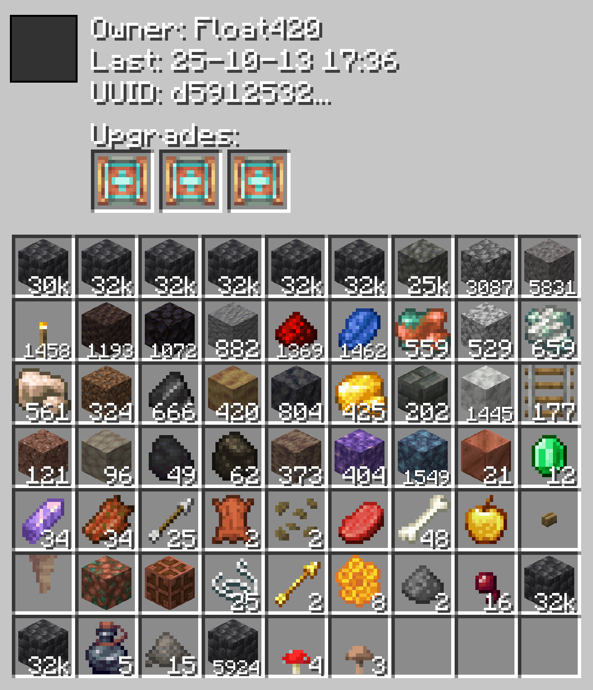

# Brasspack Visualizer
___
### A high-performance tool that renders inventory images from Sophisticated Backpacks NBT data.


### Usage:
```python
python backpack_visualizer.py -f sophisticatedbackpacks.dat --item minecraft:flint
```
```python
python backpack_visualizer.py -f sophisticatedbackpacks.dat --owner swzo
```
```python
python backpack_visualizer.py -f sophisticatedbackpacks.dat --upgrade sophisticatedbackpacks:stack_upgrade_tier_1
```
### Prerequisites:
You will need to get the sophisticated backpacks dat file from your world save, in `world/data/sophisticatedbackpacks.dat` and this is what the first argument in the usuage points to.

### Image:
