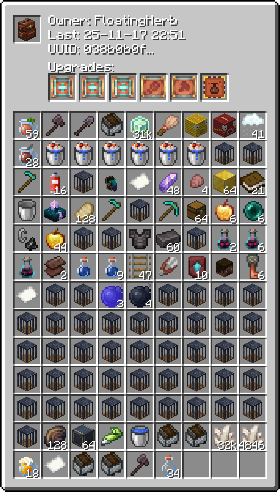
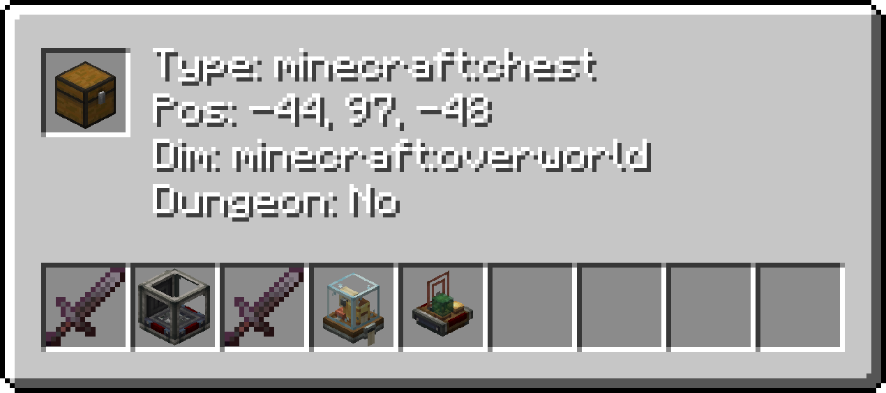

# Brasspack Visualizer
___
### A high-performance tool that renders inventory images from Sophisticated Backpacks NBT data.


### Usage:
Usuage Overview
```shell
 visualizer.py [-h] -f FILE [--mode {backpack,container}] [--owner OWNER] [--item ITEM] [--upgrade UPGRADE] [--nodungeon] [--ctype CONTAINER_TYPE] [--nbt NBT] [query]
```
1. Backpacks

Visualizes backpack .dat files from the mod.
```python
python3 visualizer.py -f sophisticatedbackpacks.dat --item minecraft:flint
```
```python
python3 visualizer.py -f sophisticatedbackpacks.dat --owner swzo
```
```python
python3 visualizer.py -f sophisticatedbackpacks.dat --upgrade sophisticatedbackpacks:stack_upgrade_tier_1
```

2. Containers

Visualizes .json dump files containing server block data.
You can combine arguments to narrow down results.
```python
# Basic container search (detects .json automatically)
python visualizer.py -f containers.json
```
```python
# Filter out Dungeon chests
python visualizer.py -f containers.json --nodungeon
```
```python
# Find chests containing a specific item
python visualizer.py -f containers.json --item "minecraft:netherite_ingot"
```
```python
# Find specific container types (e.g., only barrels)
python visualizer.py -f containers.json --ctype "minecraft:barrel"
```
```python
# Search by NBT string (loose match)
python visualizer.py -f containers.json --nbt "Unbreakable"
```
```python
# COMBINED: Find non-dungeon chests containing diamonds with "Float420" in NBT
python visualizer.py -f containers.json --nodungeon --item diamond --nbt "Float420"
```

### Prerequisites:
You will need to get the sophisticated backpacks dat file from your world save, in `world/data/sophisticatedbackpacks.dat` and this is what the first argument in the usuage points to.3

### Image:

